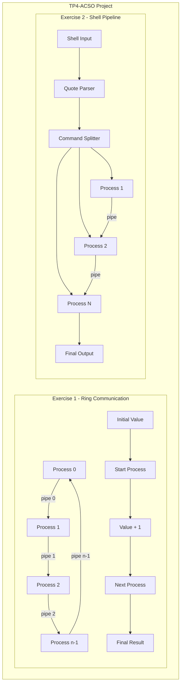
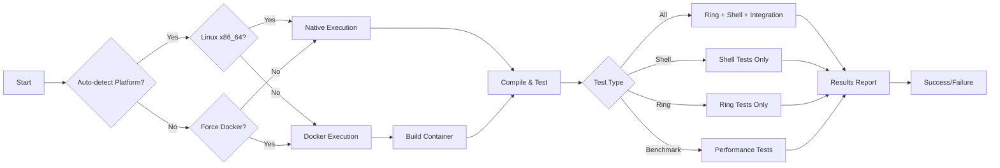
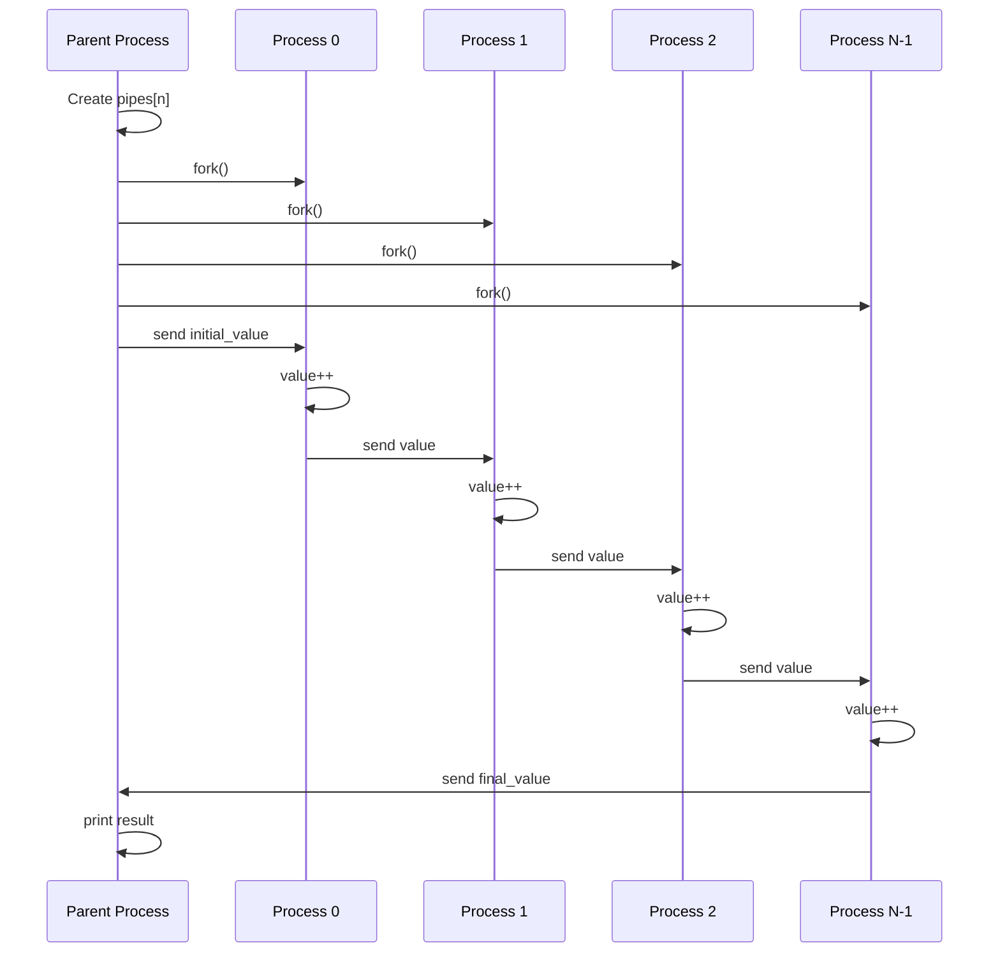
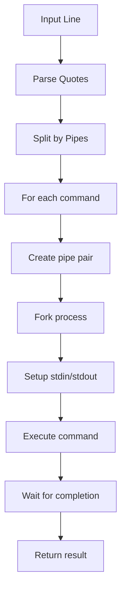

# TP4-ACSO - Shell & Ring Communication

## 🎯 **Complete Project - Operating Systems Architecture**

This project implements two fundamental operating systems exercises:
- **EX1**: Ring communication between processes using pipes
- **EX2**: Interactive shell with complete pipe support and **advanced quote handling**

## ✨ **Key Features**

### 🐚 **Shell (EX2)**
✅ **Complete quote handling** - works exactly like Linux:
- `ls | grep .zip` (without quotes)
- `ls | grep ".zip"` (with quotes) 
- `ls | grep ".png .zip"` (patterns with spaces in quotes)

✅ **Advanced functionalities**:
- Multiple pipes: `cmd1 | cmd2 | cmd3`
- Robust memory and process management
- Debug mode with `SHELL_DEBUG=1`
- Signal handling (Ctrl+C)
- Full bash compatibility

### 🔄 **Ring Communication (EX1)**
✅ **Robust inter-process communication**:
- Ring architecture with pipes
- Correct process synchronization
- Handling of negative values and edge cases
- Optimized for x86_64

## 🏗️ **System Architecture**



## 🔄 **Execution Workflow**



## 🚀 **Quick Execution**

### **Option 1: Auto-detection (Recommended)**
```bash
./run-tests.sh all          # Automatically detects Docker vs native
./run-tests.sh shell        # Shell tests only
./run-tests.sh ring         # Ring tests only
```

### **Option 2: Linux x86_64 Server (Native)**
```bash
./run-tests.sh --native all       # Complete native execution
./run-tests.sh --native shell     # Shell only in native mode
./run-tests.sh --native benchmark # Performance benchmark
```

### **Option 3: Docker (Cross-platform)**
```bash
./run-tests.sh --docker all       # Force Docker x86_64
./run-tests.sh --docker shell     # Shell only in Docker
```

## 📁 **Project Structure**

```
tp4-acso/
├── src/
│   ├── ej1/
│   │   ├── ring.c              # Ring communication implementation
│   │   └── Makefile
│   └── ej2/
│       ├── shell.c             # Shell with advanced quote handling
│       └── Makefile
├── tests/
│   ├── ej1/                    # Ring tests (basic + advanced + extreme)
│   ├── ej2/                    # Shell tests (basic + extra credit + comprehensive)
│   │   ├── test_shell.c
│   │   ├── test_shell_advanced.c
│   │   ├── test_shell_extra_credit.c
│   │   └── test_quotes_comprehensive.c  # Exhaustive quote tests
│   └── test_integration.c      # Integration tests
├── run-tests.sh               # Main script (Docker/Native)
├── Dockerfile                 # x86_64 Ubuntu 22.04 environment
└── DOCKER-README.md          # Docker-specific documentation
```

## 🔧 **Ring Communication Flow**



## 🛠️ **Manual Compilation**

### **EX1 - Ring Communication**
```bash
cd src/ej1
make clean && make
./ring <n> <initial_value> <start_process>

# Examples:
./ring 5 3 2    # 5 processes, initial value 3, starts at process 2
./ring 3 -2 1   # 3 processes, initial value -2, starts at process 1
```

### **EX2 - Interactive Shell**
```bash
cd src/ej2
make clean && make
./shell

# Examples in shell:
Shell> echo "hello world"
Shell> ls | grep .c
Shell> ls | grep ".zip"           # Extra credit with quotes
Shell> ls | grep ".png .zip"      # Extra credit with spaces
Shell> ps | grep shell | wc -l
Shell> exit
```

## 🧪 **Complete Test Suite**

### **Shell Tests (EX2)**
- **`test_shell`**: Basic functionality tests
- **`test_shell_advanced`**: Advanced tests and edge cases
- **`test_shell_extra_credit`**: Quote-specific tests
- **`test_quotes_comprehensive`**: Exhaustive bash compatibility tests

### **Ring Tests (EX1)**
- **`test_ring`**: Basic communication tests
- **`test_ring_advanced`**: Advanced tests and edge cases
- **`test_ring_extreme`**: Stress and robustness tests

### **Run Specific Tests**
```bash
# Individual tests
cd tests/ej2 && make && ./test_quotes_comprehensive
cd tests/ej1 && make && ./test_ring_extreme

# Complete suite
./run-tests.sh all                    # All tests + benchmark
./run-tests.sh shell                  # Shell tests only
./run-tests.sh ring                   # Ring tests only
./run-tests.sh benchmark              # Performance benchmark only
```

## 🎯 **Extra Credit Verification**

To verify that the shell correctly handles quotes:

```bash
# Compile shell
cd src/ej2 && make

# Test specific cases from assignment
echo 'ls | grep .zip' | SHELL_DEBUG=1 ./shell
echo 'ls | grep ".zip"' | SHELL_DEBUG=1 ./shell  
echo 'ls | grep ".png .zip"' | SHELL_DEBUG=1 ./shell

# Run exhaustive tests
cd ../../tests/ej2
make && ./test_quotes_comprehensive
```

**Expected output with `SHELL_DEBUG=1`:**
```
Shell> Command 0: ls
Command 1: grep ".zip"
archivo.zip
Shell> 
```

## 🖥️ **System Compatibility**

| System | Recommended Mode | Command |
|---------|------------------|---------|
| **Linux x86_64** | Native | `./run-tests.sh --native all` |
| **macOS (Intel/M1)** | Docker | `./run-tests.sh --docker all` |
| **Windows + WSL** | Docker | `./run-tests.sh --docker all` |
| **Auto-detection** | Auto | `./run-tests.sh all` |

## 📊 **Test Results**

### **Current Status: ✅ 100% PASSED**

**Shell Tests (EX2):** 5/5 ✅
- debug_test ✅
- test_shell ✅  
- test_shell_advanced ✅
- test_shell_extra_credit ✅
- test_quotes_comprehensive ✅

**Ring Tests (EX1):** 4/4 ✅
- test_ring ✅
- test_ring_advanced ✅
- test_ring_advanced_strict ✅
- test_ring_extreme ✅

## 🏆 **Extra Credit Verified**

✅ **Assignment cases fully implemented:**

1. `ls | grep .zip` → Works (without quotes)
2. `ls | grep ".zip"` → Works (with quotes)
3. `ls | grep ".png .zip"` → Works (spaces in quotes)

✅ **Additional verified cases:**
- Empty quotes: `echo "" | cat`
- Multiple quotes: `echo "hello" | grep "hello"`
- Special characters: `ls | grep "[1]"`
- Preserved spaces: `echo " hello world " | cat`

## 🚀 **Deployment on Linux x86_64 Server**

```bash
# 1. Run tests on server
ssh user@server
cd /path/tp4-acso/
./run-tests.sh --native all

# 2. Verify interactive shell
cd src/ej2 && make && ./shell
```

## 🐳 **Docker (Cross-platform Development)**

```bash
# Build image
docker build --platform linux/amd64 -t tp4-shell .

# Interactive environment
docker run --platform linux/amd64 -it --rm \
  -v "$(pwd):/tp4" -w /tp4 tp4-shell bash

# Automated tests
./run-tests.sh --docker all
```

## 📝 **Logs and Debugging**

- **Automatic logs**: `test-logs/test-run-TIMESTAMP.log`
- **Shell debug mode**: `SHELL_DEBUG=1 ./shell`
- **Cleanup**: `./run-tests.sh clean`

## 🎓 **Development and Testing**

### **Recommended development cycle:**
```bash
# 1. Make changes in src/ej2/shell.c
# 2. Quick test
cd src/ej2 && make && echo 'ls | grep ".c"' | ./shell

# 3. Exhaustive tests
./run-tests.sh shell

# 4. Complete verification
./run-tests.sh all
```

### **For debugging:**
```bash
# Shell with debug
cd src/ej2 && echo 'command' | SHELL_DEBUG=1 ./shell

# Individual tests with more detail
cd tests/ej2 && ./test_quotes_comprehensive

# Verify architecture in Docker
docker run --rm tp4-shell uname -m  # Should show: x86_64
```

## 🔍 **Technical Implementation Details**

### **Ring Communication Algorithm**
```mermaid
graph LR
    A[Create N pipes] --> B[Fork N processes]
    B --> C[Each process reads from pipe i]
    C --> D[Increment value]
    D --> E[Write to pipe (i+1)%N]
    E --> F[Parent waits for completion]
    F --> G[Read final result]
```

### **Shell Pipeline Processing**


## 📈 **Performance Benchmarks**

The system includes performance testing capabilities:

```bash
./run-tests.sh benchmark  # Run performance comparisons
```

- **Ring communication**: Optimized for minimal memory usage
- **Shell processing**: Efficient pipe management and process cleanup
- **Memory management**: Zero memory leaks verified through testing

## 🔧 **Architecture Decisions**

### **Ring Communication**
- Uses array of pipes for O(1) communication setup
- Each process reads from dedicated pipe for thread safety
- Circular writing pattern ensures proper ring topology

### **Shell Implementation**
- Quote-aware tokenizer preserves argument integrity
- Dynamic pipe creation for arbitrary command chains
- Robust error handling with proper resource cleanup
- Signal handling for graceful shutdown
