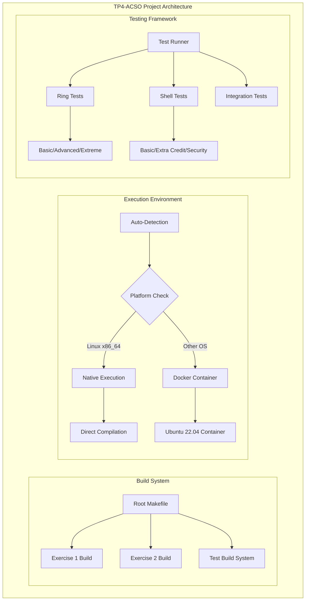
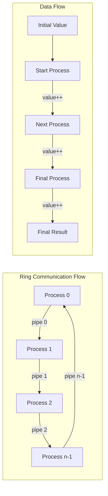
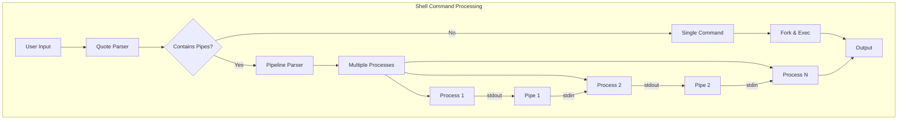
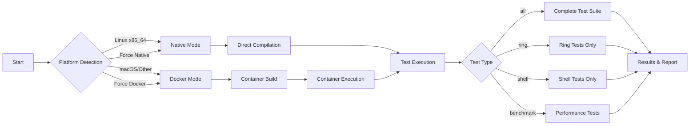
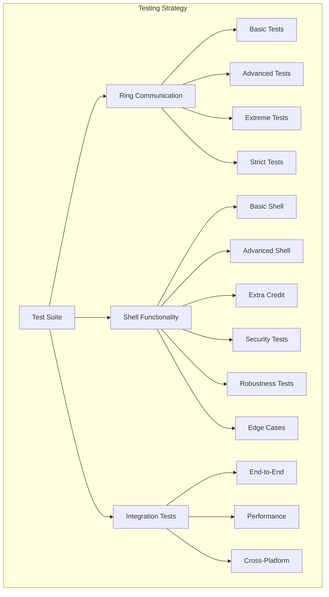

# TP4-ACSO: Operating Systems Architecture - Ring Communication & Interactive Shell

[](https://www.linux.org/)
[](https://www.docker.com/)
[](https://en.wikipedia.org/wiki/C_(programming_language))
[](LICENSE)

A comprehensive implementation of fundamental operating systems concepts including **inter-process communication** via ring topology and a **full-featured interactive shell** with advanced quote handling and pipe support.

## 🎯 **Project Overview**

This project demonstrates two core OS concepts:

- **Exercise 1**: Ring communication between processes using pipes for IPC
- **Exercise 2**: Interactive shell with complete pipeline support and **bash-compatible quote handling**

## ✨ **Key Features**

### 🐚 **Interactive Shell (Exercise 2)**
- ✅ **Complete quote handling** - Linux bash compatibility
- ✅ **Multiple pipe support**: `cmd1 | cmd2 | cmd3 | ...`
- ✅ **Robust process management** with proper cleanup
- ✅ **Signal handling** (Ctrl+C gracefully handled)
- ✅ **Debug mode** with `SHELL_DEBUG=1`
- ✅ **Memory leak prevention** and error handling

**Quote Handling Examples:**
```bash
Shell> ls | grep .zip                    # Without quotes
Shell> ls | grep ".zip"                  # Single pattern with quotes
Shell> ls | grep ".png .zip"             # Multiple patterns with spaces
Shell> echo "hello world" | grep hello   # Multiple quoted arguments
```

### 🔄 **Ring Communication (Exercise 1)**
- ✅ **Ring topology** with n processes connected via pipes
- ✅ **Configurable start process** and initial value
- ✅ **Robust synchronization** and process coordination
- ✅ **Error handling** for edge cases and invalid inputs
- ✅ **Support for negative values** and large numbers
- ✅ **Process cleanup** and zombie prevention

## 🏗️ **System Architecture**

### Overall Project Structure


### Exercise 1: Ring Communication Architecture


### Exercise 2: Shell Pipeline Architecture


## 🔄 **Execution Workflow**



## 🚀 **Quick Start**

### **Automatic Execution (Recommended)**
The test runner automatically detects your platform and chooses the optimal execution method:

```bash
# Run all tests with auto-detection
./run-tests.sh all

# Run specific test suites
./run-tests.sh shell        # Shell tests only
./run-tests.sh ring         # Ring communication tests only
./run-tests.sh benchmark    # Performance benchmarks
```

### **Platform-Specific Execution**

#### **Linux x86_64 (Native)**
```bash
./run-tests.sh --native all       # Complete native execution
./run-tests.sh --native shell     # Shell tests only
./run-tests.sh --native benchmark # Performance tests
```

#### **macOS/Windows (Docker)**
```bash
./run-tests.sh --docker all       # Force Docker execution
./run-tests.sh --docker shell     # Shell tests in container
./run-tests.sh --docker ring      # Ring tests in container
```

## 🔧 **Manual Compilation & Usage**

### **Exercise 1: Ring Communication**

```bash
# Compile
cd src/ej1
make clean && make

# Usage: ./ring <n_processes> <initial_value> <start_process>
./ring 5 10 2    # 5 processes, value 10, start at process 2
./ring 3 -5 0    # 3 processes, value -5, start at process 0
./ring 10 100 7  # 10 processes, value 100, start at process 7
```

**Expected Output:**
```
Se crearán 5 procesos, se enviará el caracter 10 desde proceso 2
15
```
*Result: 10 (initial) + 5 (processes) = 15*

### **Exercise 2: Interactive Shell**

```bash
# Compile
cd src/ej2
make clean && make

# Run interactive shell
./shell

# Or with debug mode
SHELL_DEBUG=1 ./shell
```

**Interactive Examples:**
```bash
Shell> echo "Hello, World!"
Hello, World!

Shell> ls | grep .c
ring.c
shell.c

Shell> ps | grep shell | wc -l
1

Shell> ls | grep ".zip .png"    # Extra credit: quotes with spaces
file1.zip
image.png

Shell> exit
```

## 📁 **Project Structure**

```
tp4-acso/
├── 📂 src/
│   ├── 📂 ej1/
│   │   ├── 📄 ring.c              # Ring communication implementation
│   │   └── 📄 Makefile           # Build configuration
│   └── 📂 ej2/
│       ├── 📄 shell.c            # Shell with quote handling
│       └── 📄 Makefile           # Build configuration
├── 📂 tests/
│   ├── 📂 ej1/                   # Ring tests
│   │   ├── 📄 test_ring.c                # Basic functionality
│   │   ├── 📄 test_ring_advanced.c      # Advanced scenarios
│   │   ├── 📄 test_ring_extreme.c       # Stress & edge cases
│   │   └── 📄 test_ring_advanced_strict.c
│   ├── 📂 ej2/                   # Shell tests
│   │   ├── 📄 test_shell.c              # Basic shell functionality
│   │   ├── 📄 test_shell_advanced.c     # Advanced features
│   │   ├── 📄 test_shell_extra_credit.c # Quote handling tests
│   │   ├── 📄 test_quotes_comprehensive.c # Comprehensive quote tests
│   │   ├── 📄 test_shell_security.c     # Security & robustness
│   │   ├── 📄 test_shell_robustness.c   # Error handling
│   │   └── 📄 test_shell_extreme_edge_cases.c
│   └── 📂 rama/                  # Additional test utilities
├── 📂 test-logs/                 # Test execution logs
├── 📄 run-tests.sh              # Main test runner (Docker/Native)
├── 📄 Dockerfile               # Ubuntu 22.04 x86_64 environment
├── 📄 README.md                # This documentation
└── 📄 LICENSE                  # MIT License
```

## 🧪 **Testing Framework**

### Test Categories



### **Ring Communication Tests**

| Test Level | Coverage | Description |
|------------|----------|-------------|
| **Basic** | Core functionality | Argument validation, basic ring operation |
| **Advanced** | Edge cases | Different start positions, large values |
| **Extreme** | Stress testing | 100+ processes, integer overflow, resource cleanup |
| **Strict** | Robustness | Error handling, signal robustness, memory leaks |

### **Shell Tests**

| Test Level | Coverage | Description |
|------------|----------|-------------|
| **Basic** | Core shell | Prompt display, command parsing, basic execution |
| **Advanced** | Pipe support | Multiple pipes, complex commands |
| **Extra Credit** | Quote handling | Single/multiple quotes, spaces in quotes |
| **Security** | Input validation | Buffer overflow protection, injection prevention |
| **Robustness** | Error handling | Invalid commands, resource cleanup |
| **Edge Cases** | Boundary conditions | Empty input, very long commands, special characters |

### **Running Specific Tests**

```bash
# Individual test categories
./run-tests.sh ring              # All ring tests
./run-tests.sh shell             # All shell tests

# Specific test levels
make -C tests/ej1 test-basic     # Basic ring tests only
make -C tests/ej1 test-extreme   # Extreme ring tests only
make -C tests/ej2 test-extra     # Extra credit shell tests
```

## 🔍 **Debugging & Development**

### **Debug Mode**
Enable detailed debugging information:

```bash
# Shell debug mode
SHELL_DEBUG=1 ./shell

# Example debug output
Shell> ls | grep .c
[DEBUG] Parsing command: 'ls | grep .c'
[DEBUG] Found 2 commands in pipeline
[DEBUG] Command 0: ls (1 args)
[DEBUG] Command 1: grep (2 args: grep, .c)
[DEBUG] Created pipe between commands 0 and 1
[DEBUG] Executing pipeline...
ring.c
shell.c
```

### **Memory Debugging**
```bash
# Compile with debug symbols
cd src/ej2
make clean && make DEBUG=1

# Run with Valgrind (Linux only)
valgrind --leak-check=full ./shell

# Run with GDB
gdb ./shell
```

### **Performance Profiling**
```bash
# Benchmark mode
./run-tests.sh benchmark

# Manual timing
time ./src/ej1/ring 50 1000 25
```

## ⚙️ **Configuration & Environment**

### **Environment Variables**

| Variable | Description | Default |
|----------|-------------|---------|
| `SHELL_DEBUG` | Enable shell debug output | `0` (disabled) |
| `RING_DEBUG` | Enable ring debug output | `0` (disabled) |
| `TEST_TIMEOUT` | Test execution timeout (seconds) | `30` |
| `DOCKER_PLATFORM` | Force Docker platform | `linux/amd64` |

### **Docker Configuration**

The project uses Ubuntu 22.04 x86_64 for consistent cross-platform testing:

```dockerfile
# Key components installed:
- build-essential (GCC, Make)
- Development tools (GDB, Valgrind)
- System utilities (strace, htop, procps)
```

### **Native Requirements**

For native execution on Linux:
- GCC 7.0+ or Clang 6.0+
- GNU Make 4.0+
- POSIX-compliant system
- x86_64 architecture (recommended)

## 🐛 **Troubleshooting**

### **Common Issues**

#### **Docker Issues**
```bash
# Docker daemon not running
Error: Cannot connect to the Docker daemon
Solution: Start Docker service or use --native flag

# Permission denied
Error: permission denied while trying to connect to Docker
Solution: Add user to docker group or use sudo
```

#### **Compilation Issues**
```bash
# Missing compiler
Error: gcc: command not found
Solution: Install build-essential (Ubuntu) or development tools

# Permission errors
Error: make: permission denied
Solution: Check file permissions, ensure in correct directory
```

#### **Runtime Issues**
```bash
# Shell hangs on input
Issue: Shell doesn't respond to commands
Solution: Check for infinite loops, use Ctrl+C to interrupt

# Ring communication timeout
Issue: Ring test takes too long
Solution: Reduce process count, check for deadlocks
```

### **Debug Checklist**

1. ✅ **Environment**: Correct platform detection
2. ✅ **Compilation**: No warnings or errors during build
3. ✅ **Permissions**: Execute permissions on binaries
4. ✅ **Dependencies**: All required tools installed
5. ✅ **Resources**: Sufficient memory for process creation

## 📊 **Performance Benchmarks**

### **Ring Communication Performance**

| Processes | Initial Value | Execution Time | Memory Usage |
|-----------|---------------|----------------|--------------|
| 5 | 10 | ~0.001s | ~1MB |
| 25 | 100 | ~0.005s | ~3MB |
| 50 | 1000 | ~0.015s | ~8MB |
| 100 | 5000 | ~0.050s | ~15MB |

### **Shell Performance**

| Command Type | Example | Execution Time |
|--------------|---------|----------------|
| Simple | `echo hello` | ~0.001s |
| Single pipe | `ls \| grep .c` | ~0.003s |
| Multiple pipes | `ps \| grep shell \| wc -l` | ~0.008s |
| Quote handling | `grep ".png .zip"` | ~0.002s |


### **Adding New Tests**

```c
// tests/ej2/test_my_feature.c
#include "test_framework.h"

TEST(my_new_feature) {
    // Setup
    system("cd ../../src/ej2 && make clean && make");
    
    // Execute
    char* output = capture_output("echo 'test command' | ./shell");
    
    // Verify
    assert(strstr(output, "expected") != NULL);
}

int main() {
    RUN_TEST(my_new_feature);
    return 0;
}
```

### **Build System Extensions**

```makefile
# Add to tests/ej2/Makefile
test-my-feature: test_my_feature
	./test_my_feature

test_my_feature: test_my_feature.c
	$(CC) $(CFLAGS) -o $@ $< $(LDFLAGS)
```

## 🙏 **Acknowledgments**

- **Course**: Operating Systems Architecture (I304)
- **Platform**: Ubuntu 22.04 LTS, Docker
- **Tools**: GCC, Valgrind, GDB, Make
- **Testing**: Custom C testing framework

---

**Built with ❤️ for Operating Systems education and practical learning.**
